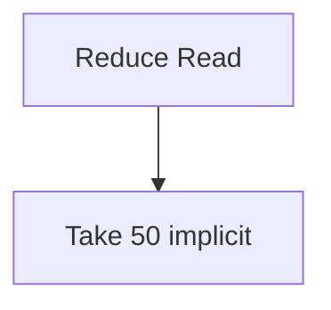

# Lin

Lin — язык своей локальной БД: пайпы, типизированный каталог, два мира записи (`append` / reducer), свой план. Не SQL и не Kusto.

Сейчас есть парсер, typecheck, IR плана, in-memory store (один reducer, один `gen`) и исполнитель. DuckDB, IDB и WASM в этом milestone нет.

## Лаконичный диалект

После `|` голый предикат — это `where`. В запросе `{ id, title }` — проекция. `where` и `pick` остаются синонимами.

```
docs | wing == "rag" and ts > ago 7d | { id, title, room }
docs | id == "e7c98d54-b4d6-4165-86e9-9b999e7ce9c3"
docs | title has "wal"
docs | title ~ "wal"
docs | title ~ /wal.*/i
orders | total > 100 | join users on user_id | { id, users.email, total }
docs | hop wikilink | { id, title }
docs | search "wal" | take 20
docs | { id } | union orders | { id }
let x = docs | wing == "rag" | { id }
x | take 5
append facts { s: "lin", p: tagged, o: "db" }
insert docs [
  { uri: "raw://a", title: "A", layer: "wiki" },
  { uri: "raw://b", title: "B", layer: "wiki" }
]
append facts [
  { s: "a", p: tagged, o: "x" },
  { s: "b", p: tagged, o: "y" }
]
append edges [
  wikilink "a" -> "b",
  wikilink "b" -> "c"
]
update docs[wing == "rag"] cas each { room: "inbox" }
delete docs[wing == "old"] cas each
index docs [wing, ts]
index orders [user_id, ts]
index docs unique [uri]
update docs[id == "…"] cas "sha256:…" { room: "inbox" }
delete docs[id == "…"] cas "sha256:…"
delete edge wikilink "a" -> "b"
delete facts[s == "lin" and p == tagged and o == "db"]
col notes { title: text }
rel cites
```

`union` — совместимые столбцы по имени после последней проекции каждой стороны. `let` — только чтение, не запись. Несколько `append`/`insert`/`delete`/`update` в одной строке `run()` — один пакет, один `gen` (или ничего); запросы после записи видят новое состояние; любая ошибка откатывает всё. Список в `insert`/`append` — один `InsertPack`/`Append`, один `gen`. `cas each` читает hash каждой строки на старте пакета и CAS-ит все; смена mid-pack откатывает всё. `update`/`delete` без `cas` / `cas each` — ошибка. Пустой `[]` — ошибка. `with edge` на списке insert запрещён. `col` / `rel` / `index` создают живую коллекцию/ребро/индекс в store.

Составной индекс: порядок полей = leftmost prefix. `wing == "rag" and ts > ago 7d` по `[wing,ts]` — `IndexSeek index=docs[wing,ts]` (равенство слева + range на следующем). Только `wing ==` — тот же индекс. Только `ts >` — scan, leftmost не закрыт. `id ==` остаётся `Get`.

`has` — целое слово (граница токена). `~ "…"` — подстрока. `~ /…/i` — регулярка (литерал проверяется при компиляции). `ago 7d` = `now - 7d` (единица обязательна).

Запись — отдельный statement, не хвост пайпа. Неизвестный столбец, hop без `rel`, join без `fk`, `update` без `cas` — ошибка компиляции.

Неявный `take 50`. Hybrid search в плане показывает RRF; исполнитель без эмбеддера идёт только lex-путём (векторные скоры не подделываются). `embed_id=nomic-embed-text/768`.

## Бенчмарки (rbench): Lin vs SQLite vs DuckDB

Сравнительные in-memory hot paths в `benches/compare.rs` через [rbench](https://github.com/themoretheless/rbench) (`Suite`, `harness = false`).

```bash
# список кейсов
cargo bench --bench compare -- --list

# быстрый прогон (нужен --release; rbench отказывается от debug)
cargo bench --bench compare -- --profile quick

# только point get / только insert
cargo bench --bench compare -- --filter point_get
cargo bench --bench compare -- --filter insert_bulk_1k --samples 8
```

Движки: **Lin**, **SQLite** (`rusqlite` bundled), **DuckDB** (bundled; собирается на mac aarch64), плюс **HashMap** только для point get. N=10 000 для тёплых чтений (fixture; setup вне тайминга). Bulk insert: схема/индекс в setup, в тайминге только запись.

Сравнимо: point get по id, `wing ==`, range `wing`+`ts`, substring (`title ~ "wal"` ≈ `LIKE '%wal%'`), bulk insert 1k/10k.  
Не сравниваем здесь (и не подтасовываем): Lin `hop`, hybrid `search`/RRF, CAS — у SQLite/DuckDB нет прямого аналога в этом бенче.

Зависимость: `rbench` из git (`branch = "main"`; ветки `release` на remote пока нет).

## Запуск

```bash
cargo test
cargo build

# план (дерево)
cargo run -- explain 'docs | wing == "rag" | search "wal" | { id, title } | explain cost'

# выполнить на fixture (эфемерная память, без --data)
cargo run -- run 'docs | wing == "rag" | { id, title }'
cargo run -- run --explain 'docs | search "wal" | take 5'

# граф плана
cargo run -- explain --graph mermaid 'docs | wing == "rag" | search "wal" | { id, title }'
cargo run -- explain --graph dot 'docs | wing == "rag" | search "wal" | { id, title }'

# то же с диском (переживает рестарт процесса)
cargo run -- --data .lin run 'insert docs { uri: "raw://n/p", title: "hi", layer: "wiki" }'
cargo run -- --data .lin run 'docs | uri == "raw://n/p" | { id, title }'
cargo run -- --data .lin run --file batch.lin
cargo run -- run - < batch.lin
```

То же в языке: `| explain graph` (Mermaid) и `| explain dot` (Graphviz). `| explain run` после исполнения пишет фактические `rows`/`ms`.

CLI: `lin run '<запрос>'` печатает строки и `gen`. `lin run --file batch.lin` и `lin run -` читают программу из файла / stdin. `lin explain '<запрос>'` печатает план или ошибку компиляции. `lin --data .lin run '…'` пишет в каталог данных.

## Данные на диске

Без `--data` store эфемерный (fixture в памяти) — так живут текущие тесты языка и исполнителя.

`--data <dir>` (привычный путь `./.lin`) открывает durable store: `Store::open`, replay в память, дальше тот же исполнитель. Запись сначала `fsync` записи лога, потом инкремент `gen`. Крах до fsync = записи не было.

```
.lin/
  head       JSON: gen, catalog_hash, embed_id
  log        append-only: u32 LE длина + JSON пакета
  snapshot   опциональный чекпоинт всего store (после 32 записей или close)
```

Пакет лога: `{"gen":N,"next_id":N,"pack":{"type":"insert"|"append_fact"|"append_edge"|"update"|"reembed"|"delete"|"delete_edge"|"schema_col"|"schema_rel"|"schema_index"|"batch",…}}`. Ячейки: `{"t":"Text","v":"…"}`. Обрезанная последняя запись лога игнорируется; при открытии лог обрезается до последнего целого фрейма. `insert … with edge` кладёт рёбра в тот же пакет. Несколько записей в одном `run()` или bulk-список — один `batch`. Индекс живёт в `schema_index` + snapshot `extra_indexes`; при open пересобирается.

## Как смотреть граф

**Mermaid** — вставить блок в GitHub / Notion / любой рендер Markdown:

````markdown

````

**DOT** — в SVG:

```bash
lin explain --graph dot 'docs | search "wal"' | dot -Tsvg > plan.svg
```

Узлы — IR плана, рёбра — поток данных. Цвет/форма по эффекту: Read (синий), Append/запись (оранжевый), Reduce (фиолетовый).
